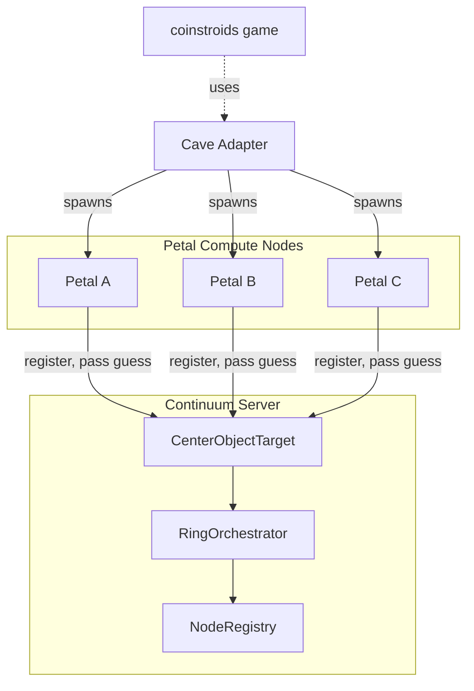
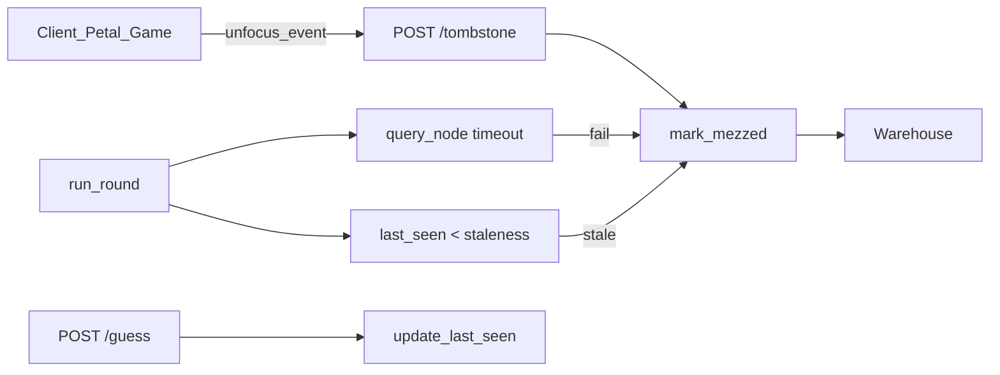

# Entropythief Ring Architecture

Daisy-shaped topology for entropy harvesting: center hub, petal compute nodes in a ring, sequential pass-along of guesses, LSTM (or fallback) prediction, and "entropy from yesterday" to avoid XOR smoke stack.

## Topology

## Components

- **CenterObjectTarget**: Daisy center hub. Receives guesses, aggregates, produces authoritative center value. Mixes prior-round entropy to avoid degenerate XOR.
- **RingOrchestrator**: Fits ring for added/removed/mezzed nodes, warehouse rotation, run_round, lifecycle logging. Supports configurable health-check and staleness timeouts.

### Mezzed Definition (Canonical)

**Mezzed** = any node in the active list that is (a) unreachable within the health-check timeout, (b) stale (no successful heartbeat/`last_seen` within the staleness window), or (c) explicitly tombstoned by the client (unfocus/suspend).

- **Health check**: `RingOrchestrator` queries each active node; if unresponsive within `health_check_timeout_seconds` (default 2), the node is marked mezzed and moved to warehouse.
- **Staleness**: When `staleness_seconds` is configured, nodes whose `last_seen` is older than that window are mezzed. `last_seen` is updated on guess submission (`POST /api/entropy/guess`).
- **Active tombstoning**: Clients can call `POST /api/entropy/nodes/tombstone` with `{"node_id": "..."}` to immediately mark themselves mezzed without waiting for health-check failure. Useful when the client loses focus or suspends (e.g., `OnApplicationPause` in Unity).

- **NodeRegistry**: Active and warehouse (mezzed) node persistence.
- **entropythief_node**: Petal executable. Probes target, registers, submits guesses. Optional LSTM; fallback predictor.
- **CaveAdapter**: Spawns nodes, `request_random`, `get_credits`, `tombstone_node`, `mezz_node`. Game-agnostic for coinstroids.

## Consumer Interface

- `request_random(tenant_id, size_bytes)` — Spend credits, get randomness. One-line API.
- `get_credits(tenant_id)` — Balance, earned, spent.
- Earn credits by running petal nodes; spend when requesting randoms. No external vendor cost.

## Coinstroids Integration

Coinstroids (john-holland/coinstroids) should:

1. Instantiate CaveAdapter with continuum URL.
2. Call `start_node(...)` to run petals and earn credits.
3. Call `request_random(tenant_id, size_bytes)` when the game needs randomness.
4. Call `get_credits(tenant_id)` to show balance.
5. **Tombstone on unfocus/suspend**: Call `tombstone_node(node_id)` when the game loses focus or the app suspends (e.g., `OnApplicationPause(true)` in Unity). This immediately moves the node to warehouse, reducing wasted health checks. On focus return (`OnApplicationPause(false)`), rely on warehouse refresh or re-register to restore the node to the ring.

Economics are tuned so active producers earn enough to spend; sustainable margins without third-party fees.

## API Endpoints

- `POST /api/entropy/nodes/register` — Register petal
- `GET /api/entropy/center` — Authoritative center guess
- `POST /api/entropy/guess` — Submit guess
- `GET /api/entropy/ring` — Ring topology
- `GET /api/entropy/nodes` — Active + warehouse
- `POST /api/entropy/nodes/tombstone` — Tombstone node (body: `{"node_id": "..."}`). Use when client loses focus or suspends.
- `POST /api/entropy/nodes/mezz` — Synonym for tombstone (same body, same behavior).
- `POST /api/entropy/orchestrator/fit` — Fit ring
- `POST /api/entropy/orchestrator/run-round` — Run round, award credits
- `GET /api/entropy/random` — Request random (spend credits)
- `GET /api/entropy/credits` — Credit balance
